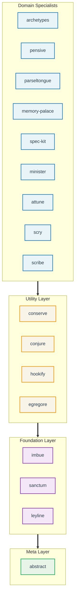

# Claude Night Market

[](CHANGELOG.md)
[](LICENSE)
[]()
[](https://docs.anthropic.com/en/docs/build-with-claude/claude-code)
[](https://github.com/athola/claude-night-market)
[](https://github.com/QAInsights/Quillx)

**Claude Code plugins for software engineering workflows.**

17 plugins providing 130 skills, 105 commands, and 43 agents
for git operations, code review, spec-driven development,
and issue management. Each plugin installs independently.

<p align="center">
  
</p>

## Quick Start

Requires **Claude Code 2.1.16+** and **Python 3.9+** for hooks.
See [Requirements](#requirements) for details.

```bash
# Add the marketplace
/plugin marketplace add athola/claude-night-market

# Install plugins you need
/plugin install sanctum@claude-night-market    # Git workflows
/plugin install pensive@claude-night-market    # Code review
/plugin install spec-kit@claude-night-market   # Spec-driven dev

# Use them
/prepare-pr                                    # Prepare a pull request
/full-review                                   # Run code review
```

**Alternative:** Install via npx with
`npx skills add athola/claude-night-market` (installs all plugins at once).

After installation, run `claude --init` for one-time setup.

> **Note:** If the `Skill` tool is unavailable, read skill files directly
> at `plugins/{plugin}/skills/{skill-name}/SKILL.md`.

### opkg (OpenPackage)

```bash
# Install specific plugins
opkg i gh@athola/claude-night-market --plugins sanctum
opkg i gh@athola/claude-night-market --plugins pensive,conserve

# Plugins that depend on shared runtime skills (e.g. attune, conjure)
# automatically pull packages/core as a dependency
```

See the [Installation Guide](book/src/getting-started/installation.md)
for detailed setup options.

## Architecture

17 plugins organized in four layers.
Domain specialists depend on utility plugins,
which depend on foundation plugins,
which depend on the meta layer.



### Plugin Catalog

| Plugin | Layer | Description | Skills | Cmds |
|--------|-------|-------------|:------:|:----:|
| **abstract** | Meta | Skill authoring, hook development, evaluation frameworks, stability monitoring | 11 | 18 |
| **leyline** | Foundation | Auth flows (GitHub/GitLab/AWS), quota management, error patterns, markdown formatting, Discussions retrieval, damage-control, stewardship, ERC-8004 trust verification | 16 | 3 |
| **sanctum** | Foundation | Git workflows, commit messages, PR prep, docs updates, version management, sessions | 14 | 18 |
| **imbue** | Foundation | TDD enforcement, proof-of-work validation, scope guarding, rigorous reasoning | 9 | 3 |
| **conserve** | Utility | Context optimization, bloat detection, CPU/GPU monitoring, token conservation | 10 | 4 |
| **conjure** | Utility | Delegation framework for routing tasks to external LLMs (Gemini, Qwen) | 4 | 0 |
| **hookify** | Utility | Behavioral rules engine with markdown configuration and hook-to-rule conversion | 2 | 6 |
| **egregore** | Utility | Autonomous agent orchestrator with session budgets, crash recovery, and quality gates | 4 | 5 |
| **pensive** | Domain | Code review, architecture review, bug hunting, Makefile audits, NASA Power of 10 | 11 | 12 |
| **attune** | Domain | Project lifecycle: brainstorm, specify, plan, initialize, execute, war-room | 12 | 10 |
| **spec-kit** | Domain | Spec-driven development: specifications, task generation, implementation | 3 | 10 |
| **parseltongue** | Domain | Python: testing, performance, async patterns, packaging | 4 | 3 |
| **minister** | Domain | GitHub issue management, label taxonomy, initiative tracking | 2 | 3 |
| **memory-palace** | Domain | Spatial knowledge organization, digital garden curation, PR review capture | 6 | 5 |
| **archetypes** | Domain | Architecture paradigm selection (hexagonal, CQRS, microservices, etc.) | 14 | 0 |
| **scribe** | Domain | Documentation with AI slop detection, style learning, tech tutorials | 4 | 3 |
| **scry** | Domain | Terminal recordings (VHS), browser recordings (Playwright), GIF processing | 4 | 2 |

Full inventory:
[Capabilities Reference](book/src/reference/capabilities-reference.md).

### How the Layers Work

**Governance.** `imbue` enforces TDD via a PreToolUse hook that
verifies test files before allowing implementation writes.
Quality gates halt execution when tests fail.

**Security.** `leyline` manages OAuth flows with local token
caching. `conserve` auto-approves safe commands while blocking
destructive operations. `sanctum` isolates named sessions, and
agents can run in worktree isolation for parallel execution.

**Orchestration.** `egregore` manages autonomous agent lifecycles
with session budgets, crash recovery, and watchdog monitoring.

**Maintenance.** `/update-ci` reconciles pre-commit hooks and
GitHub Actions with code changes. `abstract` tracks skill
stability and auto-triggers improvement agents when degradation
is detected.

**Cross-session state.** `attune`, `spec-kit`, and `sanctum`
persist state across sessions via `CLAUDE_CODE_TASK_LIST_ID`.
GitHub Discussions serve as a second persistence layer for
decisions, war-room deliberations, and evergreen knowledge.

**Risk classification.** `leyline:risk-classification` provides
4-tier task gating (GREEN/YELLOW/RED/CRITICAL). RED and CRITICAL
tasks escalate to `war-room-checkpoint` for expert deliberation.

## Common Workflows

See the [Common Workflows Guide][workflows] for full details.

| Workflow | Command | What it does |
|----------|---------|-------------|
| Project lifecycle | `/attune:mission` | Routes through brainstorm, specify, plan, execute phases |
| Initialize project | `/attune:arch-init` | Architecture-aware scaffolding with language detection |
| Review a PR | `/full-review` | Multi-discipline code review in a single pass |
| Fix PR feedback | `/fix-pr` | Address review comments progressively |
| Implement issues | `/do-issue` | Issue resolution with parallel agent execution |
| Prepare a PR | `/prepare-pr` | Quality gates, linting, clean git state |
| Write specs | `/speckit-specify` | Specification-first development |
| Catch up on changes | `/catchup` | Context recovery from recent git history |
| Codebase cleanup | `/unbloat` | Bloat removal with progressive depth levels |
| Update CI/CD | `/update-ci` | Reconcile hooks and workflows with code changes |
| Strategic decisions | `/attune:war-room` | Expert routing with reversibility scoring |
| Refine code | `/refine-code` | Duplication, algorithm, and clean code analysis |

## Requirements

- **Claude Code** 2.1.16+ (2.1.32+ for agent teams, 2.1.38+ for
  security features, 2.1.63 latest tested)
- **Python 3.9+** for hooks (macOS ships 3.9.6). Plugin packages may
  target 3.10+ via virtual environments, but all hook code must be
  3.9-compatible. See the [Plugin Development Guide][dev-guide]
  for compatibility rules.

## Plugin Development

Create a new plugin:

```bash
make create-plugin NAME=my-plugin
make validate
make lint && make test
```

Plugin layout:

```
my-plugin/
├── .claude-plugin/
│   └── plugin.json        # Metadata: skills, commands, agents, hooks
├── commands/               # Slash commands (markdown)
├── skills/                 # Agent skills (SKILL.md + modules/)
├── hooks/                  # Event handlers (Python, 3.9-compatible)
├── agents/                 # Specialized agent definitions
├── tests/                  # pytest suite
├── Makefile                # Build, test, lint targets
└── pyproject.toml          # Package config
```

See the [Plugin Development Guide][dev-guide] for structure requirements
and naming conventions. For LSP integration, see the
[LSP Guide](docs/guides/lsp-native-support.md).

## Documentation

- [Installation Guide](book/src/getting-started/installation.md) -
  setup, marketplace, post-install hooks
- [Quick Start](book/src/getting-started/quick-start.md) -
  first commands after installation
- [Common Workflows][workflows] - task-oriented usage guide
- [Plugin Development Guide][dev-guide] - creating and testing plugins
- [Capabilities Reference](book/src/reference/capabilities-reference.md) -
  full skill, command, and agent inventory
- [Tutorials](book/src/tutorials/README.md) -
  PR workflows, debugging, feature lifecycles
- [Architecture Decision Records](docs/adr/) -
  design rationale and trade-off documentation

Per-plugin documentation lives in `book/src/plugins/`
(one page per plugin).

## Stewardship

Every plugin is entrusted to the community. Five principles guide how
we maintain and improve the ecosystem: steward (not own), multiply (not
merely preserve), be faithful in small things, serve those who come
after, and think seven iterations ahead.

Each plugin README includes a Stewardship section with specific
improvement opportunities. Run `/stewardship-health` to view per-plugin
health dimensions.

See [STEWARDSHIP.md](STEWARDSHIP.md) for the full manifesto.

## Contributing

Each plugin maintains its own tests and documentation. Run `make test`
at the repo root to execute all plugin test suites. See the
[Plugin Development Guide][dev-guide] for contribution guidelines.

## Star History

[](https://star-history.com/#athola/claude-night-market&Date)

## Powered by Night Market

Using night-market plugins in your project? Add the badge:

```markdown
[](https://github.com/athola/claude-night-market)
```

[](https://github.com/athola/claude-night-market)

## License

[MIT](LICENSE)

[dev-guide]: docs/plugin-development-guide.md
[workflows]: book/src/getting-started/common-workflows.md
